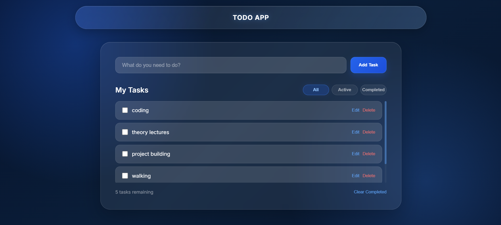
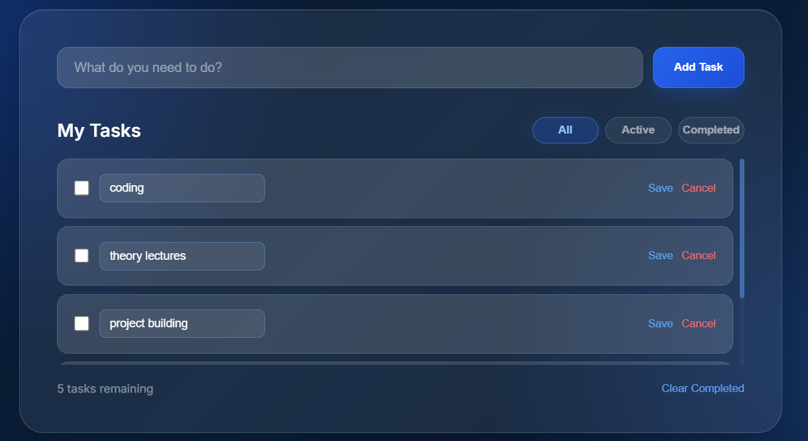
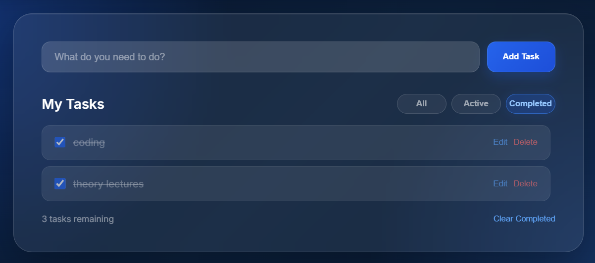

<div align="center">

# ✅ Modern Todo App

A modern and responsive **Todo Application** built using **React.js**, **JavaScript**, and **CSS**.

It allows users to add, edit, complete, delete, and filter tasks with persistent data storage using LocalStorage, all wrapped in a beautiful Glassmorphism-inspired user interface.

<br>


<br>

<p>
  
</p>

</div>

---

# 🚀 Live Demo

# https://todo-app.nexcrew.in


---

---

# 📖 About

The **Modern Todo App** is a clean and interactive task management application built with **React.js**.

The application allows users to manage their daily tasks by adding, editing, completing, deleting, and filtering todos.

The project was built to strengthen my understanding of **React Hooks**, **State Management**, **Component-Based Architecture**, **Event Handling**, **Conditional Rendering**, and **LocalStorage**.

All tasks are stored locally in the browser, allowing the data to remain available even after refreshing the page.

---

# ✨ Features

- ➕ Add New Todos
- ⌨️ Add Todos Using Enter Key
- ✏️ Edit Existing Todos
- 💾 Save Edited Todos
- ❌ Cancel Editing
- ✅ Mark Todos as Completed
- 🔄 Mark Completed Todos as Active
- 🗑️ Delete Todos
- 🔍 Filter Todos
- 📋 All Tasks Filter
- 🟢 Active Tasks Filter
- ✔️ Completed Tasks Filter
- 🧹 Clear Completed Tasks
- 📊 Dynamic Remaining Task Count
- 💾 LocalStorage Persistence
- 🆔 Unique ID for Every Todo
- 🌌 Glassmorphism UI
- 🎨 Modern Blue Theme
- 📱 Responsive Design
- ⚡ Fast and Lightweight

---

# 📸 Preview

## 🖥️ Desktop

<p align="center">
  
</p>

---

## ✏️ Edit Todo

<p align="center">
  
</p>

---

## 🔍 Todo Filters

<p align="center">
  
</p>

---

# 🛠️ Tech Stack

| Technology | Purpose |
|------------|---------|
| React.js | UI Development |
| JavaScript | Application Logic |
| CSS3 | Styling & Responsive Design |
| LocalStorage | Persistent Todo Data |
| Vite | Development & Build Tool |
| Google Fonts | Typography |

---

# 📂 Project Structure

```text
Modern-Todo-App/
│
├── public/
│
├── src/
│   ├── components/
│   │   ├── Navbar.jsx
│   │   └── Todo.jsx
│   │
│   ├── styles/
│   │   └── app.css
│   │
│   ├── App.jsx
│   └── main.jsx
│
├── screenshots/
│   ├── desktop.png
│   ├── edit.png
│   └── filter.png
│
├── package.json
├── vite.config.js
├── index.html
└── README.md
```


# ⚙️ Installation

### 1. Clone the repository

```bash
git clone https://github.com/PratikCoreDev/modern-todo-app.git
```

### 2. Navigate to the project directory

```bash
cd modern-todo-app
```

### 3. Install dependencies

```bash
npm install
```

### 4. Start the development server

```bash
npm run dev
```

Open the local development URL displayed in your terminal.

---

# ⚙️ How It Works

The application uses React state to manage todos and user interactions.

### Workflow

1. User enters a task in the input field.
2. The task is added when the **Add** button is clicked or **Enter** is pressed.
3. A unique ID is generated for the task.
4. The todo is added to the todo list.
5. Users can mark the todo as completed.
6. Users can edit existing todos.
7. Users can delete unwanted todos.
8. Filters display tasks based on their current status.
9. Completed tasks can be removed using **Clear Completed**.
10. Todo data is stored in **LocalStorage**.
11. Tasks are restored automatically when the application is reopened.

---

# 🧠 React Concepts Used

This project demonstrates several important React concepts.

### ⚛️ React Hooks

- `useState()`
- `useEffect()`

### 📦 Component-Based Architecture

The application is divided into reusable components such as:

- `Navbar`
- `Todo`
- `App`

### 🔄 State Management

React state is used to manage:

- Current todo input
- Todo list
- Todo status
- Active filter
- Edit state

### 📤 Props

Data and functions are passed between components using props.

Examples:

- Todo data
- Delete function
- Toggle function
- Edit function

### 🔀 Conditional Rendering

Conditional rendering is used for:

- Empty task state
- Edit mode
- Normal todo mode
- Active filters
- Completed tasks

---

# 💾 LocalStorage

The application uses the browser's **LocalStorage API** to persist todo data.

Whenever todos are:

- Added
- Edited
- Completed
- Deleted
- Cleared

the updated todo list is stored in LocalStorage.

When the application starts, previously saved todos are loaded automatically.

This allows users to refresh or reopen the application without losing their tasks.

---

# 🔑 Unique Todo IDs

Every todo receives a unique identifier using:

```javascript
crypto.randomUUID()
```

The unique ID is used for:

- Editing todos
- Deleting todos
- Completing todos
- React list keys

This prevents problems that can occur when using array indexes to identify tasks.

---

# 🔍 Filtering System

Users can filter their todos using three options:

### 📋 All

Displays every todo.

### 🟢 Active

Displays only unfinished todos.

### ✅ Completed

Displays only completed todos.

The filtering system dynamically updates the displayed list without modifying the original todo data.

---

# ✏️ Edit System

The application supports inline todo editing.

When the user clicks **Edit**:

1. The todo text becomes an input field.
2. The existing text is loaded into the input.
3. The user can modify the text.
4. Clicking **Save** updates the todo.
5. Clicking **Cancel** exits edit mode without changing the original task.

---

# 🧹 Clear Completed

The **Clear Completed** button removes all todos whose status is:

```text
completed
```

Active todos remain unchanged.

---

# 📊 Remaining Task Counter

The footer dynamically displays the number of active tasks.

Example:

```text
3 tasks remaining
```

When a task is completed, the counter automatically updates.

---

# 🎨 CSS Concepts Used

This project uses modern CSS features including:

- Flexbox
- Glassmorphism
- Backdrop Filter
- Linear Gradients
- Radial Gradients
- Box Shadows
- Border Effects
- Hover Effects
- CSS Transitions
- Custom Scrollbar
- Responsive Layout
- Modern Typography

---

# 📱 Responsive Design

The application is designed to work across different screen sizes.

Supported devices:

- 💻 Desktop
- 💼 Laptop
- 📱 Mobile
- 📟 Tablet

The interface adapts to different screen widths while maintaining the overall design and usability.

---

# 📚 What I Learned

Building this project helped me improve my understanding of:

- React Fundamentals
- React Hooks
- State Management
- Props
- Component Architecture
- Event Handling
- Conditional Rendering
- Array Methods
- LocalStorage
- Dynamic UI Updates
- Form and Input Handling
- CRUD Operations
- Responsive CSS
- Modern UI Design

---

# 🚀 Future Improvements

Some features I plan to add in future versions:

- 📅 Due Dates
- 🔔 Task Reminders
- 🏷️ Task Categories
- 🎯 Task Priorities
- 🔎 Search Tasks
- 📅 Calendar View
- 🌙 Dark / Light Theme
- 📌 Task Sorting
- 🔄 Drag & Drop Tasks
- 📈 Productivity Statistics
- ☁️ Cloud Database
- 🔐 User Authentication
- 📱 PWA Support

---

# ⚡ Performance

- ✅ Lightweight
- ✅ Fast UI
- ✅ Component-Based Architecture
- ✅ LocalStorage Persistence
- ✅ No Backend Required
- ✅ Responsive Interface
- ✅ Minimal Dependencies
- ✅ Smooth UI Interactions

---

# 🤝 Contributing

Contributions are welcome!

If you'd like to improve this project, follow these steps:

1. Fork the repository.

2. Create a new feature branch.

```bash
git checkout -b feature-name
```

3. Commit your changes.

```bash
git commit -m "Add new feature"
```

4. Push to your branch.

```bash
git push origin feature-name
```

5. Open a Pull Request.

Every contribution is appreciated!

---

# 📌 Why I Built This Project

This project was created to practice **React.js** by building a practical application rather than only learning individual concepts.

While developing this project, I focused on:

- Writing clean and organized code
- Building reusable React components
- Understanding React Hooks
- Managing application state
- Passing data through props
- Handling user interactions
- Implementing CRUD functionality
- Persisting data using LocalStorage
- Creating a modern Glassmorphism interface
- Improving the overall user experience

---

# 🌟 Project Highlights

✔ React-Based Todo Application

✔ Add, Edit & Delete Todos

✔ Complete / Uncomplete Tasks

✔ All / Active / Completed Filters

✔ LocalStorage Persistence

✔ Dynamic Task Counter

✔ Enter Key Support

✔ Inline Editing

✔ Glassmorphism UI

✔ Responsive Design

✔ Modern Blue Theme

✔ Clean Component Structure

---

# 📜 License

This project is licensed under the **MIT License**.

Feel free to use, modify, and distribute this project for learning and educational purposes.

---

# 🙏 Acknowledgements

Special thanks to:

- React Documentation
- MDN Web Docs
- Vite
- Google Fonts
- CSS Documentation
- Frontend Developer Community

These resources helped me while building and improving this project.

---

# 👨‍💻 About the Developer

Hi, I'm **Pratik** 👋

I'm an aspiring **Frontend Developer** passionate about building modern, responsive, and user-friendly web applications.

I enjoy learning new technologies and continuously improving my development skills by creating practical projects.

---

# 📬 Connect With Me

### GitHub

https://github.com/PratikCoreDev

---

# ⭐ Support

If you found this project helpful or interesting, please consider:

⭐ Starring the repository

🍴 Forking the repository

📝 Sharing your feedback

Every bit of support motivates me to keep learning and building more projects.

---

# 🚀 More Projects Coming Soon

Some projects I'm working on:

- 🕒 Modern Digital Clock
- 🌤 Weather Dashboard
- 📚 Smart Revision Planner
- 🎮 Minecraft Server Lists
- 📊 Dashboard UI
- 📝 Notes App
- 💰 Expense Tracker
- 🎵 Music Player
- 🌐 Portfolio Website
- 🚀 More React Projects

Stay tuned!

---

<div align="center">

## ⭐ If you like this project, don't forget to leave a Star!

### Made with ❤️ by **Pratik**

**Happy Coding! 🚀**

</div>
